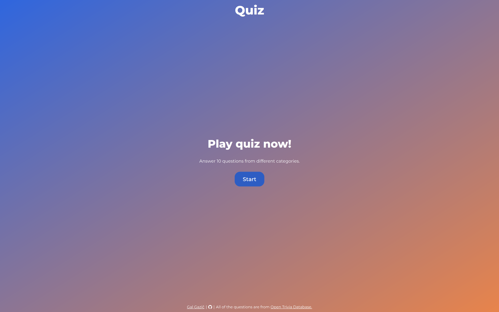
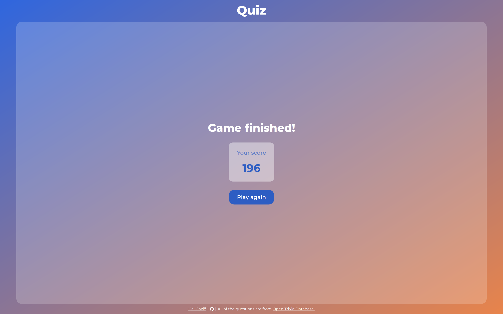
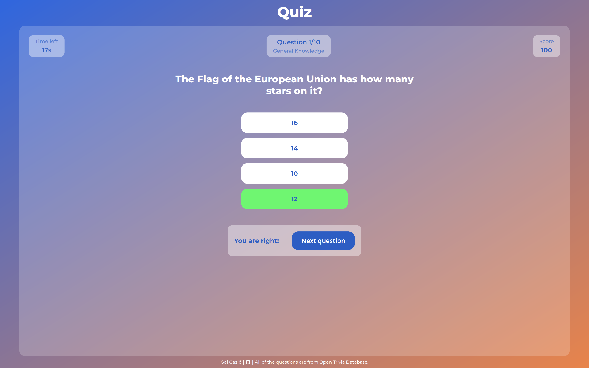
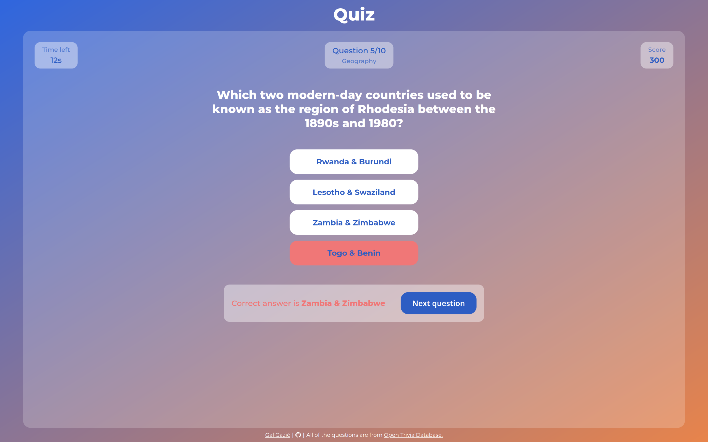
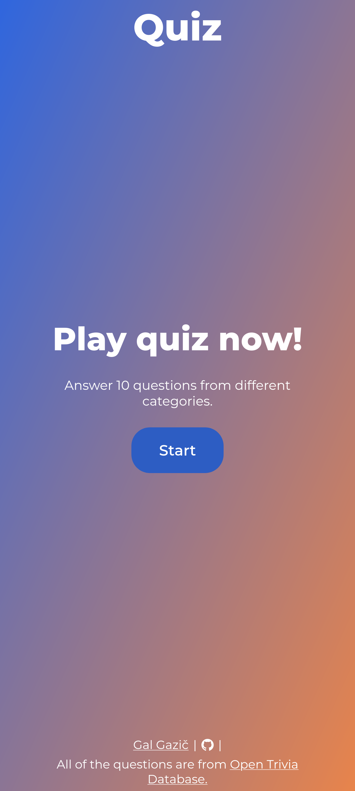
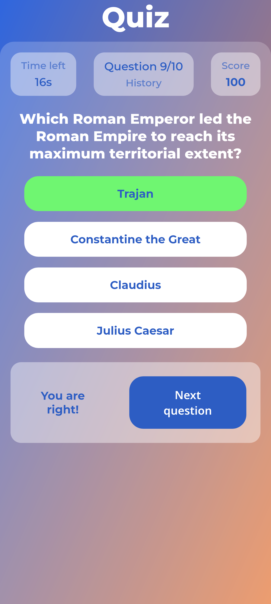
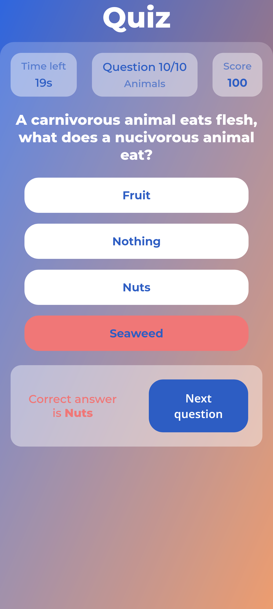
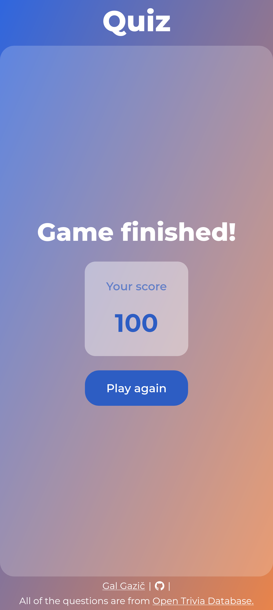

# Quiz

A simple quiz game built with JavaScript, HTML and CSS.

**You can play it here: [galgaz.github.io/quiz/](https://galgaz.github.io/quiz/)**

Source of all questions is [Open Trivia Database](https://opentdb.com).

## How it works

Each game consists of 10 random questions. You have 20 seconds to answer each question. The faster you answer, the more points you get. If you don't answer or choose the wrong answer, you receive 0 points.

Your total score is the sum of points from all questions.

## Visual overview

Video

<video width="100%" controls>
    <source src="https://galgaz.github.io/quiz/screenshots/video.mp4" type="video/mp4">
</video>

Desktop

|  |  |
|------------------------------------|------------------------------------|
|  |  |

Mobile

|  |  |  |  |
|-----------------------------------|-----------------------------------|-----------------------------------|-----------------------------------|

